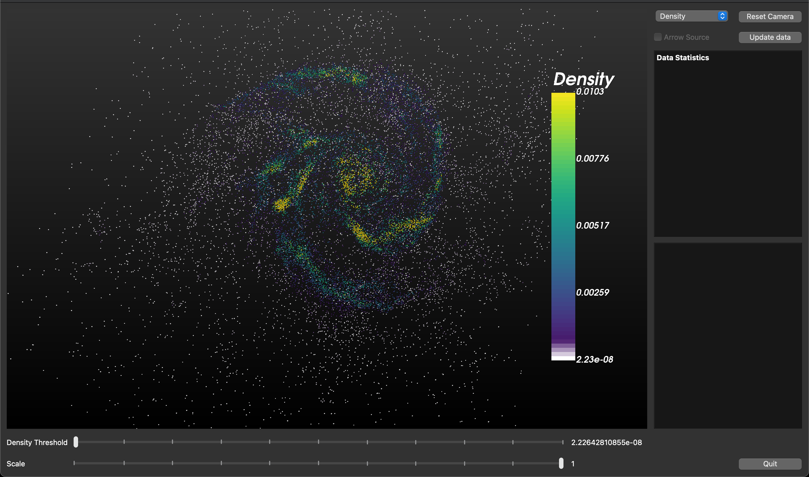

# MW-M31-VTK
## About Project
This is a visualization of a galaxy in the [IllustrisTNG project](https://www.tng-project.org/data/milkyway+andromeda/). The code for this project uses VTK and Python 3. The original files (342447.hdf5) were converted into an unstructured VTK grid using h5py. 
## Data Download 
You can access the data on the following [Link](https://drive.google.com/file/d/1uSjKHxVC-VkxUxWCKlUWu4pYgbrWovbk/view?usp=sharing). The file size is around 2GB.
## Execute code 
Replace dir with your directory where you downloaded the data.   
Note: You can also switch to gas-output.vtk for more points  
` python vis-gui.py -a [dir/data/gas-output-mini.vtk] -c [dir/data/ctfs/ctf.txt] `
## Results 
Some of the images from the results:  
Density Image 1:  

Density Image 2:  

Internal Energy Image 1:  

Internal Energy Image 2:  

Velocity Image 1:  

Velocity Image 2:  

Magnetic Field Image 1:  

Magnetic Field Image 2:  
